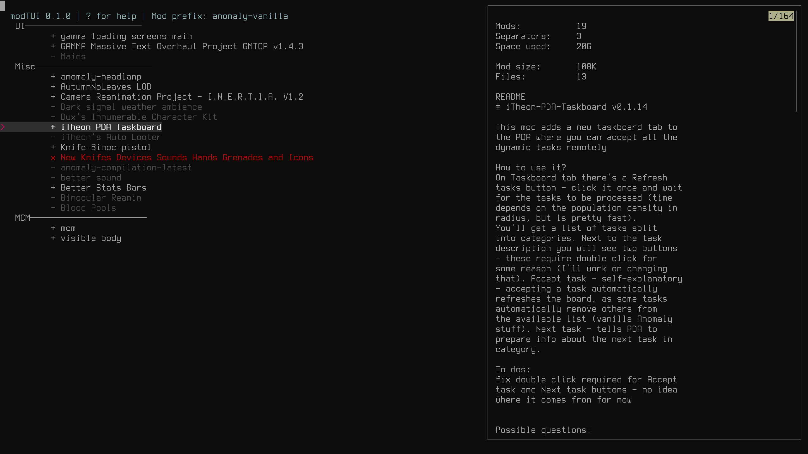

# Description
modTUI aims to provide an initial, extensible prototype for a mod manager using Linux vernacular commands and eschewing dependency on Windows-based mod managers.
In addition, modTUI defines a more robust JSON specification for modlists to account for peculiarities in Windows naming conventions, the brittleness of
simple text lists, the variability of mod directory entry points after they are unpacked, and the lack of a consistent and unified metadata format within mods themselves.

modTUI provides basic interoperability with MO2 modlists and can convert to and from the MO2 format and modTUI's JSON format.



# Dependencies
- convmv
- fzf
- jq
- wine (to launch games)

# Installation

Clone and install:
```
git clone https://github.com/aclist/modtui.git
sudo make install
```

Uninstall:

```
sudo make uninstall
```

# Basic usage
Invoke the bare command `modtui` for a full list of commands.

Add a new game config:

```
modtui add
```

This command expects and will interactively prompt you for a game root directory, a mod directory (containing one subdirectory per mod),
an existing Wine prefix, and a path to the game's executable file. You can add multiple game config provided they have unique names.

Launch a game config:

```
modtui launch <game>
```


# Detailed usage and technical discussion
Refer to the [documentation](https://aclist.github.io/modtui/modtui.html) for additional information.

# Roadmap

|Feature|Status|
|---|---|
|Resolve inter-mod conflicts|feasibility testing|
|FOMOD XML support|feasibility testing|
|BSA file handling|feasibility testing|
|Command line tab expansion|in development|
|Mass enable/disable all mods|in development|
|Bulk move mods to specific index|in development|
